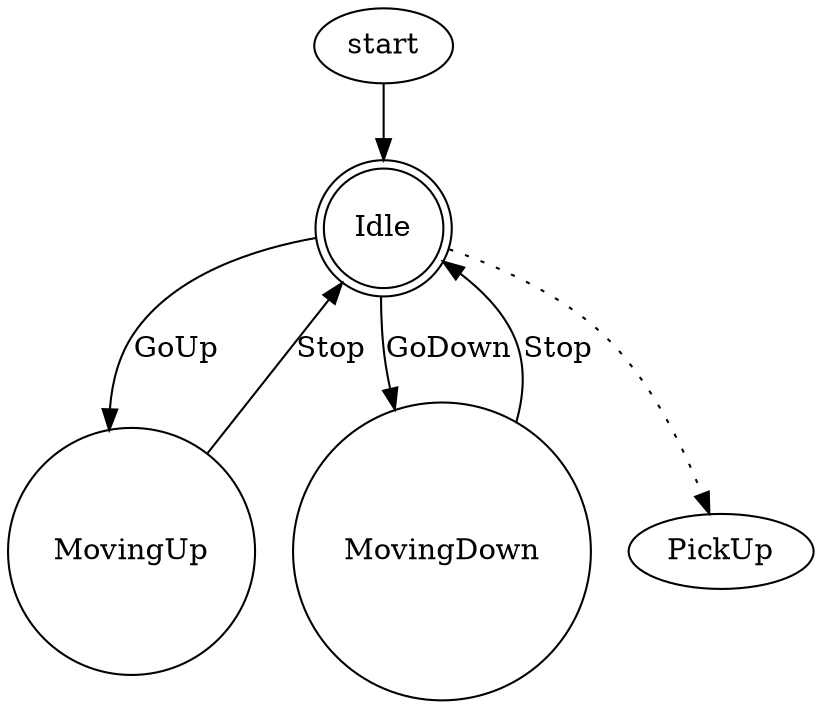

# Лабораторная 4
---

**Студент:** Ведерников Антон Владимирович  
**ИСУ:** 367970  
**Группа:** P3323  
**Университет:** НИУ ИТМО  
**Факультет:** Программная инженерия и компьютерная техника  
**Курс:** 3-й курс  

---
# Отчет

## Цель
eDSL (embedded Domain Specific Language) для конечных автоматов. eDSL должен позволять в явном виде описывать невозможные/игнорируемые переходы между состояниями. eDSL должен быть запускаемым и генерирующим описание в формате dot (подробнее см. проект graphviz). С использованием разработанного eDSL реализовать модель (одна из, определяется вариантом задания):

Лифта. При движении вниз - подбирать людей.
Светофора. Перекрёсток с главной дорогой и пешеходной кнопкой.
## Выполнение
eDSL реализован при помощи свободных монад.

Пример программы на eDSL (Лифт)
```haskell
liftModel :: FSM ()
liftModel = do
    state "Idle"
    state "MovingUp"
    state "MovingDown"
    startState "Idle"
    endState "Idle"
    transition "Idle" "GoUp" "MovingUp"
    transition "MovingUp" "Stop" "Idle"
    transition "Idle" "GoDown" "MovingDown"
    transition "MovingDown" "Stop" "Idle"
    ignore "Idle" "PickUp"
```

Результат:




## Выводы

В ходе выполнения лабораторной работы изучил устройство eDSL, изучил свободные монады и область их практического применения.
